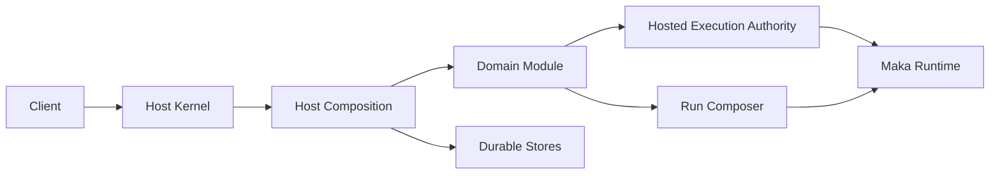

# Runtime Host: One Online Owner for Runtime Execution

> Runtime Host is the single online owner of a State Root and its Runtime executions. Clients submit bounded operations; the Host owns durable state, execution admission, recovery, and shutdown. A Client disconnect never transfers that ownership back to the Client.

This chapter is for engineers who maintain Runtime Host or connect a product domain to it. It explains the stable ownership and lifecycle contracts without repeating individual operation schemas or coordinator internals.

## Why Runtime Host exists

Runtime execution outlives a request connection. A model call may continue after a Desktop window reloads, an authenticated remote Client may disconnect, and a process may restart while durable work is active.

If each Client owns its own Runtime and recovery path, the system gains multiple writers, conflicting Session state, and connection-dependent execution. Runtime Host removes that ambiguity:

- one process owns writes for one State Root;
- Local IPC and authenticated WebSocket use the same canonical state;
- Domain code owns business decisions;
- one execution authority owns admission, stop, settlement, and recovery.

## The mental model



| Component | Owns |
|---|---|
| Host Kernel | State Root ownership, transport, connection authority, residency, drain, and shutdown |
| Host Composition | Static composition identity, Store construction, Domain Modules, and shared authorities |
| Domain Module | One domain's handlers, recovery, drain, close, and connection cleanup |
| Hosted Execution Authority | Root admission, execution identity, stop, terminal reconciliation, and recovery |
| Run Composer | The immutable prompt, tool, policy, and source-revision basis for one Run |

## Four identities that must stay separate

| Identity | Meaning | Lifetime |
|---|---|---|
| State Root | The canonical directory for durable Host state | Survives Host processes |
| Host Epoch | One process instance that acquired the root owner | Ends with that process |
| Composition ID | The static Host composition allowed to use the State Root | Persistently bound to the root |
| Host Generation | The Runtime Host build requested by a local ephemeral Client | Product build, or one development Client process |

A restart creates a new Host Epoch. A software update can also change the Host Generation. Neither changes the State Root or its Composition ID.

## Ownership boundaries

### Host Kernel owns process lifecycle

The Kernel acquires the State Root writer owner, starts required listeners, authenticates connections, creates immutable connection authority, and drives Composition recovery, drain, and close.

The Kernel does not interpret messages, prompts, tools, Goal state, Automation state, or Agent Graph state. New domain behavior enters through a Domain Module rather than another Kernel branch.

### Host Composition owns static assembly

Composition is fixed before startup. Its descriptor contains only a stable ID and revision. Actual Module IDs come from the created Composition, so diagnostics cannot drift from runtime ownership.

Each protocol operation has exactly one Module owner. Composition combines those owners; it does not keep a parallel implementation of their handlers or lifecycle.

Recovery runs through five fixed phases:

1. `state`
2. `resources`
3. `executions`
4. `domains`
5. `schedulers`

Close runs in reverse Module order. Drain and close attempt every owner and aggregate failures.

### Domain Modules own business lifecycle

A Domain Module receives narrow constructor ports and owns its handlers and resources. It can use shared Host contracts, but it does not find services through a dynamic registry or create a second Runtime authority.

The Domain decides what an execution result means and what should happen next. Hosted Execution only owns the execution lifecycle.

### Hosted Execution owns root execution lifecycle

Hosted Execution is the only online authority for root execution. Admission atomically returns the initial snapshot, completion handle, and cleanup settlement handle for the exact execution.

Consumers use durable terminal projection to decide the business result and the settlement handle to know when execution cleanup has finished. They do not reconstruct these handles later from a Session ID or Turn ID.

Subscriptions are wake-up hints. Recovery always rereads durable facts.

### Run Composer owns the provider-dispatch basis

Run Composer freezes the model-visible basis for a Run: base system prompt, tool catalog, tool availability policy, base provider options, and source revisions.

Before the first physical provider dispatch:

1. build the immutable Run Composition snapshot;
2. commit it to the AgentRun Store;
3. dispatch only after the commit succeeds.

A failed composition or commit fails closed. A Run that never dispatches does not invent a composition snapshot.

### Runtime Host resolves workspaces

Clients identify a workspace with one closed target:

```ts
type WorkspaceTarget =
  | { kind: "project"; projectId: string }
  | { kind: "host_path"; path: string };
```

`project` is the portable form. Runtime Host resolves it through its Project Catalog and returns a projection containing the canonical target and `hostCwd`. `host_path` is for a Client that has explicit Host-path authority, such as a local CLI started in a checkout.

The Project Catalog has revision-pinned, paginated summary and location views. The summary is path-free; reading locations requires Host-path authority.

Clients do not combine a path with a Project ID or resolve a Host path themselves. Desktop keeps its selected Project as a root-scoped Client preference; selecting a Project does not mutate global Host state. A Client without Host-path authority can use a registered Project, but cannot register, relink, request a Host-side reveal, or submit a Host path.

Skill catalog management is a Host-filesystem operation. It requires Host-path authority and returns the workspace resolved by that operation.

## Lifecycle

| Stage | Contract |
|---|---|
| Startup | Acquire root owner, bind Composition identity, build Composition, recover Modules, start schedulers, then publish Ready |
| Request | Authenticate, decode bounded input, enforce connection authority, route to the unique Module handler |
| Execution | Reserve and admit through Hosted Execution, then reconcile terminal state from durable facts |
| Drain | Reject new admission while already accepted work converges |
| Close | Close Modules in reverse order, close listeners, then release the State Root owner |

A Client disconnect releases only connection-scoped resources. It does not cancel an admitted execution.

### Local ephemeral upgrade handoff

A Host Generation is separate from protocol compatibility: two builds can speak the same protocol but still require process replacement so the new Runtime code becomes authoritative. A local owner Client may request an exact-Host-Epoch drain. The Kernel then uses the normal drain path, and the successor waits for the existing owner lock to be released.

When startup finds another generation, the Host may return bounded activity counts for connections, operations, and residency categories. These facts explain why the process remains resident; they do not grant termination authority. Only local ephemeral Hosts support takeover. Service Hosts publish their lifecycle explicitly and remain connectable across Client generations; their deployment owner coordinates upgrades.

Choosing Wait stops connection attempts until the observed Host process exits, so waiting does not keep an otherwise idle Host alive.

For an ephemeral Host, update preparation carries the user's interrupt choice into the Host. The Kernel checks existing work and closes admission in one decision, then enters the normal drain path. For a service Host, Desktop quiesces only its own reconnection; it does not drain the deployment-owned Host. Desktop resumes reconnection if installation is rejected.

## Core invariants

1. One State Root has at most one writer owner.
2. One Session has at most one root Hosted Execution or pending root admission.
3. Local IPC and WebSocket share one dispatcher, authority model, and canonical state.
4. Transport owns framing and authentication, not Domain state.
5. Composition is fixed before startup.
6. One protocol operation has one Module owner.
7. Notifications are hints; Stores remain recovery authority.
8. Provider dispatch waits for a durable Run Composition commit.
9. Domain lifecycle and execution lifecycle remain separate.
10. Shutdown continues closing other owners after one owner fails.
11. Runtime Host is the only resolver from `WorkspaceTarget` to a canonical Host path.

## How failures converge

| Failure | Required behavior |
|---|---|
| Composition mismatch | Fail before listeners or Domain Store mutation; do not enter a candidate spawn loop |
| Host crash | A successor rereads Stores and idempotently reconciles execution and Domain state |
| Lost notification | Reread the canonical projection; never infer terminal state from callback delivery |
| Run Composition failure | Do not call the provider |
| Client disconnect | Keep admitted work under Host ownership |
| Partial shutdown failure | Aggregate the error while continuing to release remaining resources |

Runtime Host does not claim exactly-once behavior for arbitrary external side effects. The concrete Tool or resource owner must report an observed outcome, an unknown outcome, or an explicit recovery result.

## Protocol and security boundary

- Protocol messages use closed schemas, bounded input and output, and typed errors.
- Authentication completes before protocol connection admission.
- Connection authority fixes the principal, operation grants, and path or capability access.
- Adding a protocol operation does not expand an existing credential grant.
- Status and diagnostics expose only bounded, redacted lifecycle and composition facts.

## Code-reading map

- [`host-kernel.ts`](../../packages/runtime-host/src/server/host-kernel.ts): process ownership, listeners, connection lifecycle, drain, and shutdown
- [`host-composition.ts`](../../packages/runtime-host/src/server/host-composition.ts): composition identity, Module contract, recovery, and close order
- [`hosted-execution-authority.ts`](../../packages/runtime-host/src/server/hosted-execution-authority.ts): root execution contract
- [`workspace-resolver.ts`](../../packages/runtime-host/src/server/workspace-resolver.ts): Project and Host-path workspace resolution
- [`run-composition.ts`](../../packages/core/src/run-composition.ts): durable Run Composition schema
- [`state-root-composition.ts`](../../packages/storage/src/state-root-composition.ts): persistent Composition binding

## Validation contract

Changes to these boundaries should preserve tests for:

- State Root ownership and Composition binding;
- Local IPC and WebSocket state sharing, authentication, and listener rollback;
- unique handler ownership, phased recovery, reverse close, and aggregate failure;
- Hosted Execution admission, stop, settlement, and restart recovery;
- immutable Run Composition commit and pre-dispatch fail-closed behavior;
- Client disconnect, drain, and crash recovery end to end.
- Project-based workspace use without Host-path authority, and rejection of unauthorized Host paths.

Repository-wide format, lint, typecheck, and test gates remain required for changes that cross these boundaries.

## Summary

Runtime Host keeps one ownership story: the Kernel owns the process, Composition owns assembly, Modules own business lifecycle, Hosted Execution owns execution lifecycle, and Run Composer owns the provider-dispatch basis. Durable Stores connect those lifetimes across process restart.
