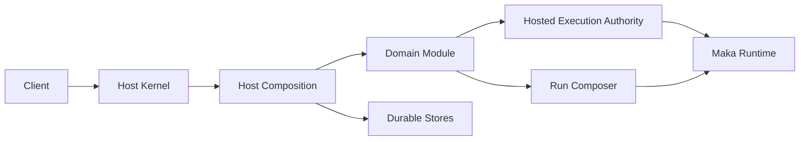

# Runtime Host：Runtime 执行的唯一在线宿主

> Runtime Host 是一个 State Root 及其 Runtime execution 的唯一在线 owner。Client 只提交有界操作；Host 持有 durable state、execution admission、recovery 和 shutdown。Client disconnect 不会把这些所有权转回 Client。

本文面向维护 Runtime Host 或接入产品领域的工程师。它只解释稳定的所有权和 lifecycle contract，不重复每个 operation schema 或 coordinator 的实现细节。

## 为什么需要 Runtime Host

Runtime execution 的生命周期长于一次连接。模型调用可能在 Desktop window reload 后继续，authenticated remote Client 可能断开，进程也可能在 durable work 尚未结束时重启。

如果每个 Client 都拥有自己的 Runtime 与恢复路径，系统会出现多个 writer、冲突的 Session state，以及依赖连接存活的 execution。Runtime Host 消除这些歧义：

- 一个进程拥有一个 State Root 的写权限；
- Local IPC 与 authenticated WebSocket 使用同一份 canonical state；
- Domain code 拥有业务决策；
- 一个 execution authority 拥有 admission、stop、settlement 与 recovery。

## 心智模型



| 组件 | 拥有的责任 |
|---|---|
| Host Kernel | State Root ownership、transport、connection authority、residency、drain 与 shutdown |
| Host Composition | 静态 composition identity、Store 创建、Domain Modules 与共享 authorities |
| Domain Module | 一个领域的 handlers、recovery、drain、close 与 connection cleanup |
| Hosted Execution Authority | Root admission、execution identity、stop、terminal reconciliation 与 recovery |
| Run Composer | 一次 Run 的 immutable prompt、tool、policy 与 source-revision 基线 |

## 四种不能混合的 identity

| Identity | 含义 | 生命周期 |
|---|---|---|
| State Root | Host durable state 的 canonical 目录 | 跨 Host 进程存在 |
| Host Epoch | 一次取得 root owner 的进程实例 | 随该进程结束 |
| Composition ID | 允许使用该 State Root 的静态 Host composition | 持久绑定到 root |
| Host Generation | 本地 ephemeral Client 请求的 Runtime Host build | Product build，或一个 development Client process |

重启会创建新的 Host Epoch；软件更新也可能改变 Host Generation。两者都不会改变 State Root 或 Composition ID。

## 所有权边界

### Host Kernel 拥有进程生命周期

Kernel 取得 State Root writer owner，启动 required listeners，认证连接，创建 immutable connection authority，并驱动 Composition recovery、drain 与 close。

Kernel 不解释 message、prompt、tool、Goal state、Automation state 或 Agent Graph state。新增领域行为通过 Domain Module 接入，而不是给 Kernel 状态机增加分支。

### Host Composition 拥有静态装配

Composition 在启动前固定。Descriptor 只包含稳定 ID 与 revision；实际 Module IDs 来自已创建的 Composition，因此 diagnostics 不会与真实 ownership 漂移。

每个 protocol operation 只有一个 Module owner。Composition 组合这些 owner，不保留平行的 handler 或 lifecycle 实现。

Recovery 使用五个固定 phase：

1. `state`
2. `resources`
3. `executions`
4. `domains`
5. `schedulers`

Close 按 Module 反序执行。Drain 与 close 会尝试每个 owner，并聚合失败。

### Domain Module 拥有业务生命周期

Domain Module 通过明确的 constructor ports 获取依赖，并拥有自己的 handlers 与 resources。它可以使用共享 Host contract，但不会通过动态 registry 查找 service，也不会创建第二个 Runtime authority。

Domain 决定 execution result 的业务含义和下一步动作。Hosted Execution 只拥有 execution lifecycle。

### Hosted Execution 拥有 root execution 生命周期

Hosted Execution 是 root execution 的唯一在线 authority。Admission 原子返回该 execution 的初始 snapshot、completion handle 与 cleanup settlement handle。

Consumer 使用 durable terminal projection 判断业务结果，使用 settlement handle 判断 execution cleanup 是否完成。它们不能在 admission 后再用 Session ID 或 Turn ID 重新拼装这些引用。

Subscription 只是唤醒提示。Recovery 始终重新读取 durable facts。

### Run Composer 拥有 provider dispatch 基线

Run Composer 冻结一次 Run 的 model-visible 基线：base system prompt、tool catalog、tool availability policy、base provider options 与 source revisions。

首次 physical provider dispatch 前必须：

1. 创建 immutable Run Composition snapshot；
2. 将其提交到 AgentRun Store；
3. durable commit 成功后才能 dispatch。

Composition 或 commit 失败时必须 fail closed。没有发生 dispatch 的 Run 不伪造 composition snapshot。

### Runtime Host 解析 workspace

Client 只使用一种 closed target 表达 workspace：

```ts
type WorkspaceTarget =
  | { kind: "project"; projectId: string }
  | { kind: "host_path"; path: string };
```

`project` 是可跨机器传递的形式。Runtime Host 通过自己的 Project Catalog 解析它，并返回包含 canonical target 与 `hostCwd` 的 projection。`host_path` 只供拥有明确 Host-path authority 的 Client 使用，例如从本地 checkout 启动的 CLI。

Project Catalog 提供 revision-pinned、paginated 的 summary 与 location view。Summary 不包含 path；读取 location 必须拥有 Host-path authority。

Client 不把 path 与 Project ID 拼在一起，也不自行解析 Host path。Desktop 将所选 Project 保存为按 root 隔离的 Client preference；选择 Project 不修改 Host 全局状态。没有 Host-path authority 的 Client 可以使用已注册 Project，但不能注册、relink、请求 Host 侧 reveal 或提交 Host path。

Skill Catalog 管理属于 Host 文件系统操作。它要求 Host-path authority，并返回该操作实际解析出的 workspace。

## 生命周期

| 阶段 | Contract |
|---|---|
| Startup | 取得 root owner，绑定 Composition identity，创建 Composition，恢复 Modules，启动 schedulers，最后发布 Ready |
| Request | Authentication、bounded decode、connection authority 检查，再路由到唯一 Module handler |
| Execution | 通过 Hosted Execution reservation 与 admission，从 durable facts reconcile terminal state |
| Drain | 拒绝新 admission，同时让已接收工作收敛 |
| Close | 反序关闭 Modules，关闭 listeners，最后释放 State Root owner |

Client disconnect 只释放 connection-scoped resources，不取消已经 admission 的 execution。

### 本地 ephemeral upgrade handoff

Host Generation 与 protocol compatibility 是两个事实：两个 build 即使使用相同 protocol，也可能必须替换进程，才能让新版 Runtime code 成为 authority。本地 owner Client 可以针对精确 Host Epoch 请求 drain。Kernel 继续使用正常 drain 路径，successor 则等待现有 owner lock 释放。

Startup 发现另一个 generation 时，Host 可以返回 connection、operation 与 residency category 的 bounded activity count。这些事实用于解释进程为什么仍在驻留，并不授予 termination authority。只有本地 ephemeral Host 支持 takeover。Service Host 会明确发布自己的 lifecycle，并可被不同 Client generation 连接；升级由 deployment owner 协调。

选择等待后，Client 会停止连接尝试，直到所观察的 Host 进程退出。因此，等待本身不会让本应进入 idle exit 的 Host 继续驻留。

对于 ephemeral Host，更新准备会把用户是否允许中断的选择传给 Host。Kernel 在同一个决策点检查现有工作并关闭 admission，然后进入正常 drain。对于 service Host，Desktop 只暂停自己的 reconnect，不会 drain 由部署系统拥有的 Host。安装被拒绝时，Desktop 恢复 reconnect。

## 核心不变量

1. 一个 State Root 最多有一个 writer owner。
2. 一个 Session 最多有一个 root Hosted Execution 或 pending root admission。
3. Local IPC 与 WebSocket 共享一个 dispatcher、authority model 与 canonical state。
4. Transport 拥有 framing 与 authentication，不拥有 Domain state。
5. Composition 在启动前固定。
6. 一个 protocol operation 只有一个 Module owner。
7. Notification 只是提示；Store 才是 recovery authority。
8. Provider dispatch 等待 Run Composition durable commit。
9. Domain lifecycle 与 execution lifecycle 保持分离。
10. 一个 owner 关闭失败时，shutdown 仍继续关闭其余 owner。
11. 只有 Runtime Host 能把 `WorkspaceTarget` 解析为 canonical Host path。

## 失败如何收敛

| 失败 | 必须遵守的行为 |
|---|---|
| Composition mismatch | 在 listener 或 Domain Store mutation 前失败，不能进入 Candidate spawn loop |
| Host crash | Successor 重新读取 Store，幂等 reconcile execution 与 Domain state |
| Notification 丢失 | 重读 canonical projection，不能从 callback delivery 推断 terminal state |
| Run Composition 失败 | 不调用 provider |
| Client disconnect | 已 admission 的工作继续由 Host 持有 |
| Partial shutdown failure | 聚合错误，同时继续释放其余 resources |

Runtime Host 不承诺任意 external side effect 的 exactly-once。具体 Tool 或 resource owner 必须报告 observed outcome、unknown outcome 或明确的 recovery result。

## 协议与安全边界

- Protocol message 使用 closed schema、bounded input/output 与 typed errors。
- Authentication 在 protocol connection admission 前完成。
- Connection authority 固定 principal、operation grants 与 path/capability access。
- 新增 protocol operation 不会扩张既有 credential grant。
- Status 与 diagnostics 只公开 bounded、redacted 的 lifecycle 与 composition facts。

## 代码阅读地图

- [`host-kernel.ts`](../../packages/runtime-host/src/server/host-kernel.ts)：process ownership、listeners、connection lifecycle、drain 与 shutdown
- [`host-composition.ts`](../../packages/runtime-host/src/server/host-composition.ts)：composition identity、Module contract、recovery 与 close order
- [`hosted-execution-authority.ts`](../../packages/runtime-host/src/server/hosted-execution-authority.ts)：root execution contract
- [`workspace-resolver.ts`](../../packages/runtime-host/src/server/workspace-resolver.ts)：Project 与 Host-path workspace resolution
- [`run-composition.ts`](../../packages/core/src/run-composition.ts)：durable Run Composition schema
- [`state-root-composition.ts`](../../packages/storage/src/state-root-composition.ts)：persistent Composition binding

## 验证契约

修改这些边界时，应保留以下测试：

- State Root ownership 与 Composition binding；
- Local IPC/WebSocket state sharing、authentication 与 listener rollback；
- unique handler ownership、phased recovery、reverse close 与 aggregate failure；
- Hosted Execution admission、stop、settlement 与 restart recovery；
- immutable Run Composition commit 与 pre-dispatch fail-closed；
- Client disconnect、drain 与 crash recovery 的端到端行为。
- 无 Host-path authority 时使用 Project workspace，并拒绝未授权 Host path。

跨越这些边界的改动仍须通过全仓 format、lint、typecheck 与 tests。

## 小结

Runtime Host 只保留一套 ownership：Kernel 拥有 process，Composition 拥有 assembly，Modules 拥有 business lifecycle，Hosted Execution 拥有 execution lifecycle，Run Composer 拥有 provider-dispatch basis。Durable Stores 让这些生命周期在进程重启后继续收敛。
